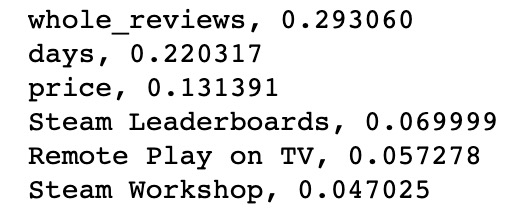

# 5001_Project----Kaggle Competition for Playtime Prediction

## File Instruction

### CSV file:
'train.csv' and 'test.csv' are raw datasets I get from Kaggle official website.
'new_train.csv' and 'new_test.csv' are datasets I use for training and testing.
'Final_Result.csv' is the result I submitted.

### Notebook:
'Date Prepossing and Model Training.ipynb' includes data prepossing and the model I use. Related notes has been put in the notebook. You can directly run it to get the prediction for test dataset.

## Experiment Details:

### Data Prepocessing:
For missing values in train dataset, I drop the rows in order to get more accurate samples to train the model. For them in test dataset, I make up those Nan by 0 or near time point. 
For columns of 'total_positive reviews' and 'total_negative reviews' in training csv file, I extract more useful features 'the whole reviews' and 'posive reviews ratio' which are more concerned in real life. 
I also further cut down some features according to my model performance.

### Model:
I choose Random Forest to train the model by 'sklearn' tool. After training, I can get the importance(weights) for each feature, and based on this result, I redo the feature extraction in the above process. We can see the top  five features in the following picture.

;

